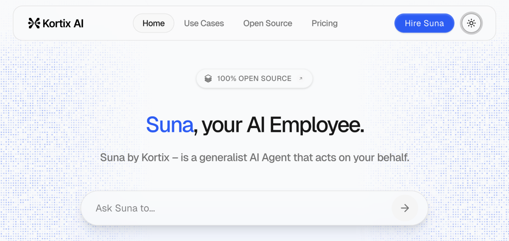

<div align="center">

# 🌟 Suna AI Platform - Open Source AI Agent Platform

*Build, Deploy, and Scale AI Agents with Complete Computer Use Capabilities*



**Suna** is a comprehensive, open-source AI agent platform that enables you to create sophisticated AI agents capable of real-world computer interactions. Whether you're automating business processes, building intelligent assistants, or creating custom AI workflows, Suna provides the complete infrastructure you need.

## ✨ Key Features

🤖 **Full Computer Use** - Agents can control browsers, execute commands, manage files  
🔧 **Extensible Architecture** - Plugin system with MCP (Model Context Protocol) support  
🌐 **Web Automation** - Advanced browser automation and web scraping capabilities  
💾 **File Management** - Complete file system operations and document processing  
🔍 **Smart Search** - Web crawling, data extraction, and research automation  
⚡ **Real-time Execution** - Isolated Docker environments for secure agent operations  
📊 **Dashboard & Analytics** - Comprehensive monitoring and management interface  
🔐 **Enterprise Ready** - Pluggable authentication (local mock for dev), team management, billing integration

[](./LICENSE)
[](https://github.com/cetinmustafa83/suna-ai-platform)
[](https://github.com/cetinmustafa83/suna-ai-platform/issues)
[](https://github.com/cetinmustafa83/suna-ai-platform/actions)

</div>

## 🚀 Quick Start

### Prerequisites

- **Docker & Docker Compose** - For containerized deployment
- **Node.js 18+** - For frontend development
- **Python 3.11+** - For backend development
- **Git** - For source code management

### 🐳 Docker Setup (Recommended)

1. **Clone the repository**
   ```bash
   git clone https://github.com/cetinmustafa83/suna-ai-platform.git
   cd suna-ai-platform
   ```

2. **Environment Configuration**
   ```bash
   # Copy environment files
   cp backend/.env.example backend/.env
   cp frontend/.env.example frontend/.env
   
   # Edit with your API keys and configurations
   nano backend/.env
   nano frontend/.env
   ```

3. **Start the platform**
   ```bash
   docker-compose up -d
   ```

4. **Access the application**
   - Frontend: http://localhost:3000
   - Backend API: http://localhost:8000
   - API Documentation: http://localhost:8000/docs

### 🛠️ Development Setup

#### Backend Development
```bash
cd backend
python -m venv venv
source venv/bin/activate  # On Windows: venv\Scripts\activate
pip install -r requirements.txt
uvicorn api:app --reload --port 8000
```

#### Frontend Development
```bash
cd frontend
npm install
npm run dev
```

### 🔑 Configuration

#### Required Environment Variables

**Backend (.env)**
```env
# AI Model Configuration
ANTHROPIC_API_KEY=your_anthropic_key
OPENAI_API_KEY=your_openai_key

# Database (Backend database is pluggable, specific variables depend on choice)
# For local development with mock auth, specific DB setup is not strictly enforced by the core.
# SUPABASE_URL=your_supabase_url # Removed
# SUPABASE_ANON_KEY=your_supabase_anon_key # Removed
# SUPABASE_SERVICE_ROLE_KEY=your_service_role_key # Removed

# Backend Mock Authentication (for local development)
# Set to "true" to enable mock authentication, bypassing external JWT validation.
# Uses a default MOCK_USER_ID ("mock-user-id-backend") for API requests.
MOCK_AUTH_ENABLED=true

# Redis
REDIS_URL=redis://localhost:6379

# Other services
LANGFUSE_SECRET_KEY=your_langfuse_key
SENTRY_DSN=your_sentry_dsn
```

**Frontend (.env)**
```env
# NEXT_PUBLIC_SUPABASE_URL=your_supabase_url # Removed
# NEXT_PUBLIC_SUPABASE_ANON_KEY=your_supabase_anon_key # Removed
NEXT_PUBLIC_BACKEND_URL=http://localhost:8000
# For local development, frontend uses RxDB (in-browser) and mock auth.
# No specific frontend env vars needed for mock auth itself.
```

## Table of Contents

- [🏗️ Architecture](#architecture)
  - [Backend API](#backend-api)
  - [Frontend Dashboard](#frontend-dashboard)
  - [Agent Runtime](#agent-runtime)
  - [Database & Storage](#database--storage)
- [🎯 Use Cases](#use-cases)
- [🔧 Agent Tools](#agent-tools)
- [📖 API Documentation](#api-documentation)
- [🚀 Deployment](#deployment)
- [🤝 Contributing](#contributing)
- [📄 License](#license)

## 🏗️ Architecture


Suna is built with a modern, scalable architecture designed for production workloads:

### Backend API
- **🐍 Python/FastAPI** - High-performance REST API with async support
- **🔀 Thread Management** - Concurrent agent execution and state management  
- **🤖 LLM Integration** - Multi-provider support (Anthropic, OpenAI, etc.) via LiteLLM
- **🔐 Authentication** - JWT-based auth (pluggable, with local mock system for development)
- **📊 Monitoring** - Built-in metrics, logging, and observability

### Frontend Dashboard
- **⚛️ Next.js/React** - Modern, responsive web application
- **🎨 Tailwind CSS** - Beautiful, customizable UI components
- **📱 Responsive Design** - Optimized for desktop and mobile
- **⚡ Real-time Updates** - WebSocket integration for live agent monitoring
- **🔒 Role-based Access** - Team management and permission controls

### Agent Runtime
- **🐳 Docker Containers** - Isolated, secure execution environments
- **🌐 Browser Automation** - Headless Chrome with advanced web interaction
- **💻 Code Execution** - Python, Node.js, and shell command support
- **📁 File System Access** - Secure file operations with sandboxing
- **🔧 Tool Integration** - Extensible plugin system with MCP protocol

### Database & Storage
- **🗄️ Pluggable Backend Database** - Backend can be integrated with PostgreSQL or other databases.
- **💻 RxDB (Frontend)** - Used for local development data persistence in the browser.
- **⚡ Redis** - High-performance caching and session management
- **🗂️ File Storage** - S3-compatible object storage for agent artifacts
- **🔄 Migration System** - Database versioning and schema management

## 🎯 Use Cases

### 🏢 Business Automation
- **Data Research & Analysis** - Automated market research and competitive analysis
- **Lead Generation** - Intelligent prospect discovery and qualification
- **Content Creation** - Blog posts, reports, and marketing materials
- **Process Automation** - Workflow optimization and task automation

### 🔬 Development & Testing
- **Code Review & Analysis** - Automated code quality assessment
- **API Testing** - Comprehensive endpoint testing and validation  
- **Documentation Generation** - Automatic docs from code and specifications
- **Deployment Automation** - CI/CD pipeline integration and management

### 📊 Data Operations
- **Web Scraping** - Large-scale data extraction and processing
- **Data Pipeline Management** - ETL processes and data validation
- **Report Generation** - Automated business intelligence reports
- **Database Maintenance** - Schema optimization and data cleaning

### 🎓 Research & Education
- **Academic Research** - Literature reviews and data collection
- **Learning Assistance** - Personalized tutoring and explanation
- **Knowledge Base Creation** - Automated documentation and wikis
- **Trend Analysis** - Market and technology trend identification

## 🔧 Agent Tools

Suna provides a comprehensive toolkit for agent development:

### 🌐 Web & Browser Tools
- **Browser Control** - Full Chrome automation with screenshot capabilities
- **Web Scraping** - Advanced data extraction with smart parsing
- **Search Integration** - Multi-engine search with result aggregation
- **Form Automation** - Intelligent form filling and submission

### 💾 File & Data Tools  
- **File Operations** - Create, read, write, and manage files
- **Data Processing** - CSV, JSON, XML parsing and transformation
- **Image Processing** - Computer vision and image analysis
- **Document Generation** - PDF, Word, and presentation creation

### 💻 System & Development Tools
- **Shell Execution** - Secure command-line operations
- **Code Execution** - Multi-language code runner with safety checks
- **API Integration** - RESTful API client with authentication
- **Version Control** - Git operations and repository management

### 🔌 Integration Tools
- **MCP Protocol** - Model Context Protocol for external tool integration
- **Database Connectors** - SQL and NoSQL database operations
- **Cloud Services** - AWS, Azure, GCP integration
- **Notification Systems** - Email, Slack, Discord, and webhook support

## 📖 API Documentation

### Core Endpoints

#### Agent Management
```http
POST /api/agents                    # Create new agent
GET /api/agents                     # List agents
GET /api/agents/{id}               # Get agent details
PUT /api/agents/{id}               # Update agent
DELETE /api/agents/{id}            # Delete agent
```

#### Thread Operations
```http
POST /api/threads                   # Create thread
GET /api/threads/{id}/messages     # Get messages
POST /api/threads/{id}/messages    # Send message
GET /api/threads/{id}/status       # Get thread status
```

#### Tool Management
```http
GET /api/tools                      # List available tools
POST /api/tools/execute            # Execute tool
GET /api/tools/{name}/schema       # Get tool schema
```

### WebSocket Events
```javascript
// Real-time agent updates
ws://localhost:8000/ws/threads/{thread_id}

// Event types:
// - agent_started
// - tool_executed  
// - message_received
// - thread_completed
// - error_occurred
```

## 🚀 Deployment

### Production Docker Deployment

1. **Prepare environment**
   ```bash
   cp docker-compose.prod.yml docker-compose.yml
   # Configure production environment variables
   ```

2. **Deploy with Docker Compose**
   ```bash
   docker-compose up -d
   ```

### Kubernetes Deployment

```yaml
# Example Kubernetes configuration
apiVersion: apps/v1
kind: Deployment
metadata:
  name: suna-backend
spec:
  replicas: 3
  selector:
    matchLabels:
      app: suna-backend
  template:
    metadata:
      labels:
        app: suna-backend
    spec:
      containers:
      - name: backend
        image: suna/backend:latest
        ports:
        - containerPort: 8000
        env:
        - name: DATABASE_URL
          valueFrom:
            secretKeyRef:
              name: suna-secrets
              key: database-url
```

### Cloud Platform Deployment

#### AWS ECS/Fargate
- Complete ECS task definitions provided
- Auto-scaling configuration
- Load balancer integration
- CloudWatch monitoring

#### Azure Container Instances
- ARM templates included
- Azure Active Directory integration
- Application Insights monitoring

#### Google Cloud Run
- Cloud Build configurations
- IAM and security settings
- Cloud SQL integration

## 🤝 Contributing

We welcome contributions from the community! Here's how to get started:

### Development Workflow

1. **Fork the repository**
   ```bash
   git clone https://github.com/your-username/suna-ai-platform.git
   ```

2. **Create feature branch**
   ```bash
   git checkout -b feature/amazing-feature
   ```

3. **Set up development environment**
   ```bash
   make dev-setup  # Sets up local development environment
   ```

4. **Make your changes**
   - Follow our coding standards
   - Add tests for new features
   - Update documentation

5. **Run tests**
   ```bash
   make test           # Run all tests
   make test-backend   # Backend tests only
   make test-frontend  # Frontend tests only
   ```

6. **Submit pull request**
   - Provide clear description
   - Link related issues
   - Ensure CI passes

### Code Style & Standards

- **Python**: Black, isort, pylint
- **TypeScript**: ESLint, Prettier
- **Commit messages**: Conventional Commits
- **Documentation**: Clear docstrings and comments

### Reporting Issues

- Use GitHub Issues for bug reports
- Include reproduction steps
- Provide environment details
- Add relevant logs/screenshots

## 📄 License

Handles data persistence with authentication, user management, conversation history, file storage, agent state, analytics, and real-time subscriptions.

## Use Cases

1. **Competitor Analysis** ([Watch](https://www.suna.so/share/5ee791ac-e19c-4986-a61c-6d0659d0e5bc)) - _"Analyze the market for my next company in the healthcare industry, located in the UK. Give me the major players, their market size, strengths, and weaknesses, and add their website URLs. Once done, generate a PDF report."_

2. **VC List** ([Watch](https://www.suna.so/share/804d20a3-cf1c-4adb-83bb-0e77cc6adeac)) - _"Give me the list of the most important VC Funds in the United States based on Assets Under Management. Give me website URLs, and if possible an email to reach them out."_

3. **Looking for Candidates** ([Watch](https://www.suna.so/share/3ae581b0-2db8-4c63-b324-3b8d29762e74)) - _"Go on LinkedIn, and find me 10 profiles available - they are not working right now - for a junior software engineer position, who are located in Munich, Germany. They should have at least one bachelor's degree in Computer Science or anything related to it, and 1-year of experience in any field/role."_

4. **Planning Company Trip** ([Watch](https://www.suna.so/share/725e64a0-f1e2-4bb6-8a1f-703c2833fd72)) - _"Generate me a route plan for my company. We should go to California. We'll be in 8 people. Compose the trip from the departure (Paris, France) to the activities we can do considering that the trip will be 7 days long - departure on the 21st of Apr 2025. Check the weather forecast and temperature for the upcoming days, and based on that, you can plan our activities (outdoor vs indoor)."_

5. **Working on Excel** ([Watch](https://www.suna.so/share/128f23a4-51cd-42a6-97a0-0b458b32010e)) - _"My company asked me to set up an Excel spreadsheet with all the information about Italian lottery games (Lotto, 10eLotto, and Million Day). Based on that, generate and send me a spreadsheet with all the basic information (public ones)."_

6. **Automate Event Speaker Prospecting** ([Watch](https://www.suna.so/share/7a7592ea-ed44-4c69-bcb5-5f9bb88c188c)) - _"Find 20 AI ethics speakers from Europe who've spoken at conferences in the past year. Scrapes conference sites, cross-references LinkedIn and YouTube, and outputs contact info + talk summaries."_

7. **Summarize and Cross-Reference Scientific Papers** ([Watch](https://www.suna.so/share/c2081b3c-786e-4e7c-9bf4-46e9b23bb662)) - _"Research and compare scientific papers talking about Alcohol effects on our bodies during the last 5 years. Generate a report about the most important scientific papers talking about the topic I wrote before."_

8. **Research + First Contact Draft** ([Watch](https://www.suna.so/share/6b6296a6-8683-49e5-9ad0-a32952d12c44)) - _"Research my potential customers (B2B) on LinkedIn. They should be in the clean tech industry. Find their websites and their email addresses. After that, based on the company profile, generate a personalized first contact email where I present my company which is offering consulting services to cleantech companies to maximize their profits and reduce their costs."_

9. **SEO Analysis** ([Watch](https://www.suna.so/share/43491cb0-cd6c-45f0-880c-66ddc8c4b842)) - _"Based on my website suna.so, generate an SEO report analysis, find top-ranking pages by keyword clusters, and identify topics I'm missing."_

10. **Generate a Personal Trip** ([Watch](https://www.suna.so/share/37b31907-8349-4f63-b0e5-27ca597ed02a)) - _"Generate a personal trip to London, with departure from Bangkok on the 1st of May. The trip will last 10 days. Find an accommodation in the center of London, with a rating on Google reviews of at least 4.5. Find me interesting outdoor activities to do during the journey. Generate a detailed itinerary plan."_

11. **Recently Funded Startups** ([Watch](https://www.suna.so/share/8b2a897e-985a-4d5e-867b-15239274f764)) - _"Go on Crunchbase, Dealroom, and TechCrunch, filter by Series A funding rounds in the SaaS Finance Space, and build a report with company data, founders, and contact info for outbound sales."_

12. **Scrape Forum Discussions** ([Watch](https://www.suna.so/share/7d7a5d93-a20d-48b0-82cc-e9a876e9fd04)) - _"I need to find the best beauty centers in Rome, but I want to find them by using open forums that speak about this topic. Go on Google, and scrape the forums by looking for beauty center discussions located in Rome. Then generate a list of 5 beauty centers with the best comments about them."_

## Self-Hosting

**Note:** This section is currently outdated due to the removal of Supabase as a direct dependency for local development. It will be updated to reflect a more generic backend and database setup process for self-hosting. For local development, please refer to the Docker or local Python/Node setup instructions above, which now use a mock authentication system and RxDB for frontend data.

Suna can be self-hosted on your own infrastructure. For a comprehensive guide to self-hosting Suna, please refer to our (soon to be updated) [Self-Hosting Guide](./docs/SELF-HOSTING.md).

The setup process will typically include:

- Setting up your chosen backend database (e.g., PostgreSQL).
- Configuring Redis for caching and session management.
- Setting up Daytona (or similar container execution environment) for secure agent execution.
- Integrating with LLM providers (Anthropic, OpenAI, Groq, etc.).
- Configuring web search and scraping capabilities.

### Quick Start (Example - Needs Update)

1. **Clone the repository**:

```bash
git clone https://github.com/kortix-ai/suna.git
cd suna
```

2. **Run the setup wizard**:

```bash
python setup.py
```

3. **Start or stop the containers**:

```bash
python start.py
```

### Manual Setup

See the [Self-Hosting Guide](./docs/SELF-HOSTING.md) for detailed manual setup instructions.

The wizard will guide you through all necessary steps to get your Suna instance up and running. For detailed instructions, troubleshooting tips, and advanced configuration options, see the [Self-Hosting Guide](./SELF-HOSTING.md).

## Contributing

We welcome contributions from the community! Please see our [Contributing Guide](./CONTRIBUTING.md) for more details.

## Acknowledgements

### Main Contributors

- [Adam Cohen Hillel](https://x.com/adamcohenhillel)
- [Dat-lequoc](https://x.com/datlqqq)
- [Marko Kraemer](https://twitter.com/markokraemer)

### Technologies

- [Daytona](https://daytona.io/) - Secure agent execution environment
- [RxDB](https://rxdb.info/) - Local frontend database for development
- [Playwright](https://playwright.dev/) - Browser automation
- [OpenAI](https://openai.com/) - LLM provider
- [Anthropic](https://www.anthropic.com/) - LLM provider
- [Tavily](https://tavily.com/) - Search capabilities
- [Firecrawl](https://firecrawl.dev/) - Web scraping capabilities
- [RapidAPI](https://rapidapi.com/) - API services

## License

Kortix Suna is licensed under the Apache License, Version 2.0. See [LICENSE](./LICENSE) for the full license text.
